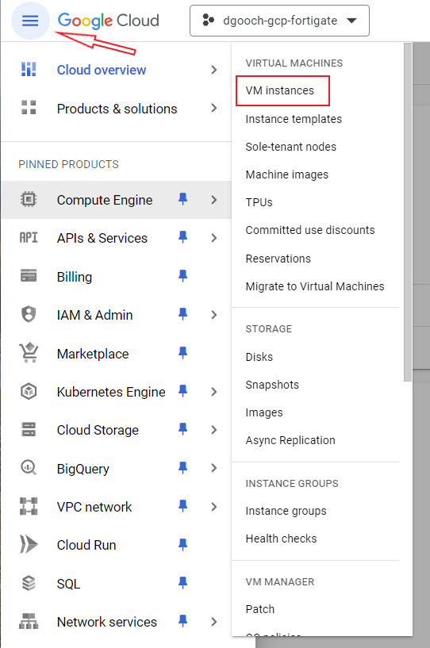
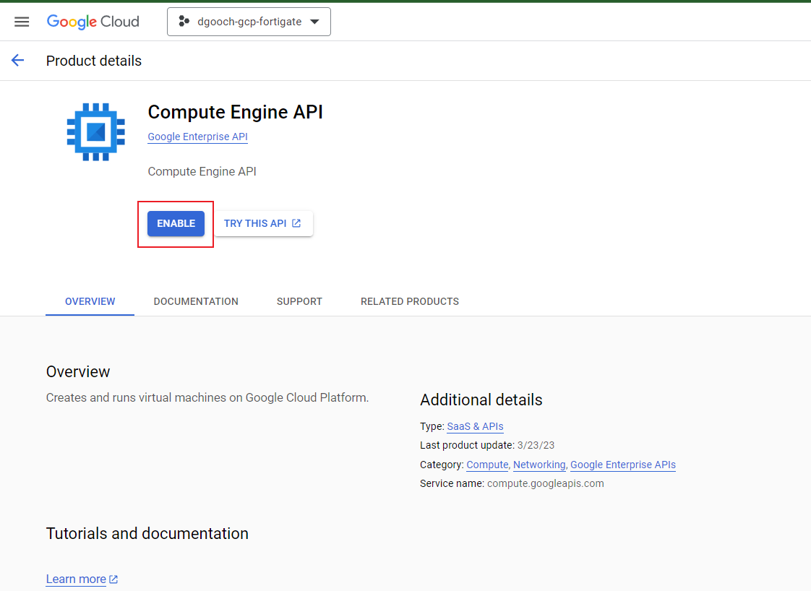

## Task 2 Enable Compute Engine API

Using the link from the email, login to the GCP console using your Fortinet AD Credentials.

- As this project is newly built, you will need to enable the Compute Engine API.  There are two methods to accomplish this:
  - Using Cloud Shell:
    ```
        gcloud services enable compute.googleapis.com
    ``` 
  - Using the Console: 
      - From the original GCP Console, click the "hamburger" menu on the top left of the screen, select **Compute Engine > VM instances**
      
      - This will take you to a screen where you can enable the Compute Engine API.  Select **Enable**
      
      - Once enabled, you will be re-directed to the VM instances Screen.
