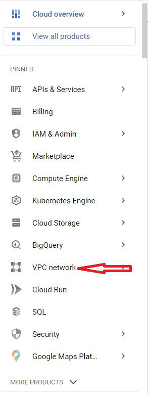
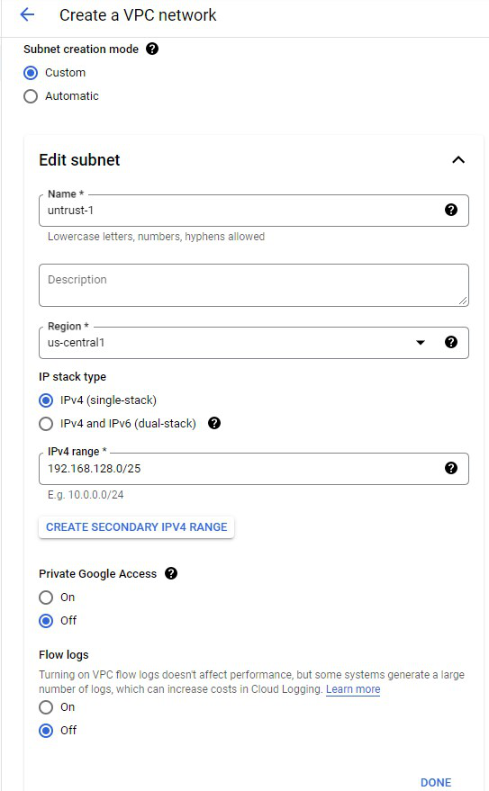
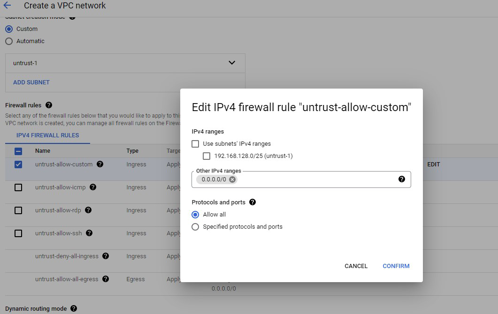

### Create VPC Networks

{} - The GCP approach to VPC Networks is a bit different than other Vendors.  For example: In AWS, a VPC is a collection of Subnets.  VM instances completely reside within a VPC and have NICs in multiple subnets.  By Contrast, in GCP an instance can only have one vNIC within a VPC Network.  These VPC Networks can be divided into Subnets, but a Virtual Machine can only have a vNIC in one of them.  This means that in order to create a standard Untrust/Trust architecture in GCP, you need two separate VPC Networks. {}

* On the left pane, click on **VPC network**

    

* At the top of the screen, click on **CREATE VPC NETWORK**

* Input all fields as directed below.
  
  **Any Value not listed below will be left as default.**

1. For "Name" use "untrust"
1. For "Subnet Creation Mode", **Custom** is selected.
1. Under **New Subnet** name the subnet **untrust-1** and select **us-central1** region from Dropdown
1. Under **New Subnet** type **192.168.128.0/25** and select **Done**.
    
1. Under **Firewall Rules** select **untrust-allow-custom** and click on **EDIT** to the right of the rule.
1. This will cause a pop up.  
1. Un-check **Use subnets' IPv4 ranges** and type "0.0.0.0/0" under other IPv4 Ranges.
    
1. Click **CONFIRM**
1. Click **CREATE**
1. Repeat the process to create a second VPC Network named **trust** and with a subnet CIDR of **192.168.129.0/25**.

{} Don't Forget to do step 10!  {}

{} Normally we would recommend for Customers to lock down their ingress Firewall rules to only allow the Sources and Ports necessary.  In our lab excercise, we left everything open here, just to make things easier. {}

  