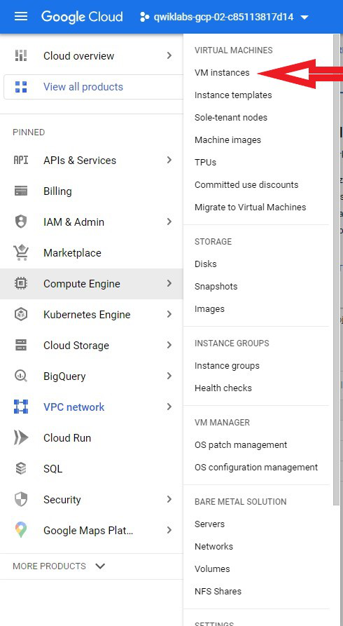
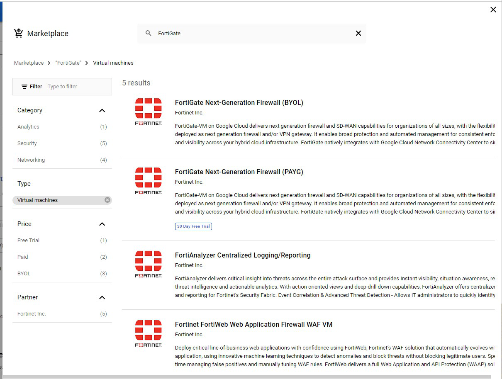
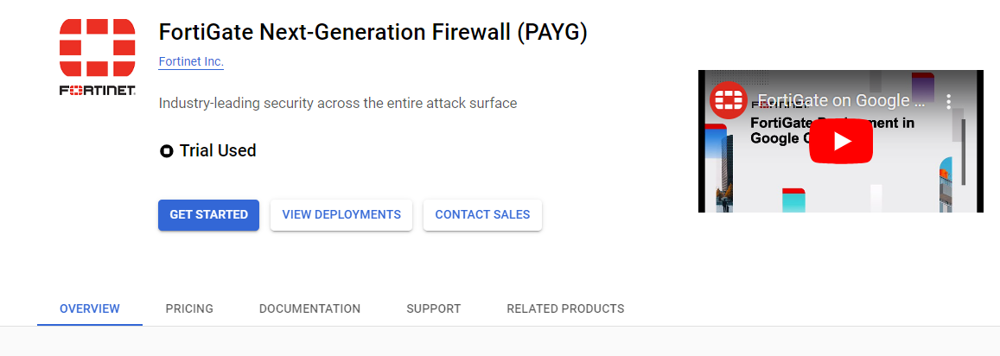
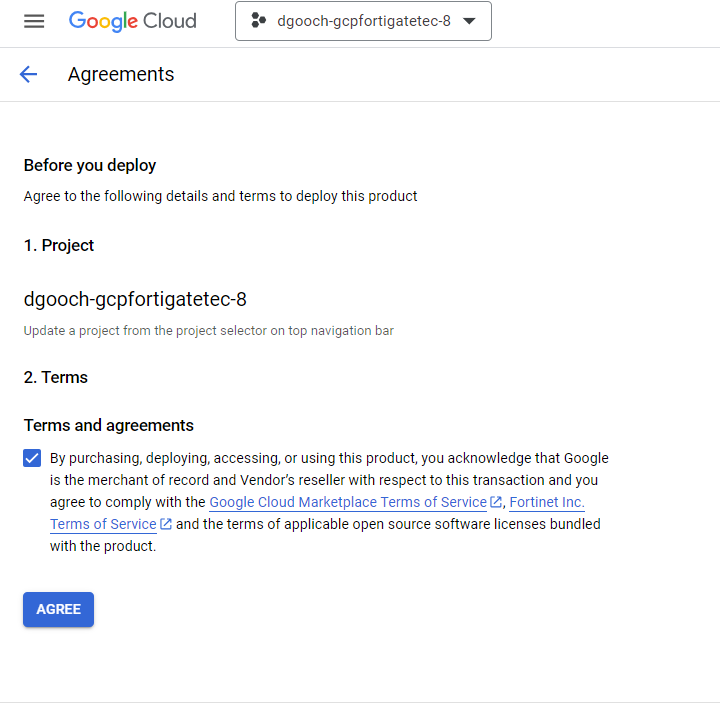
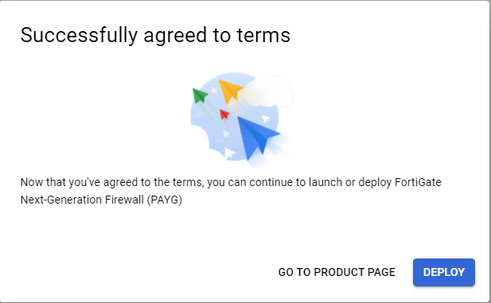
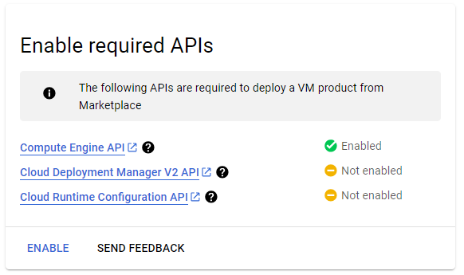
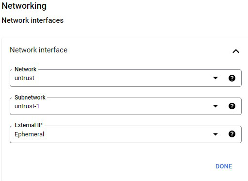
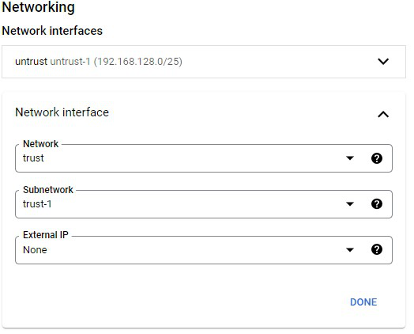
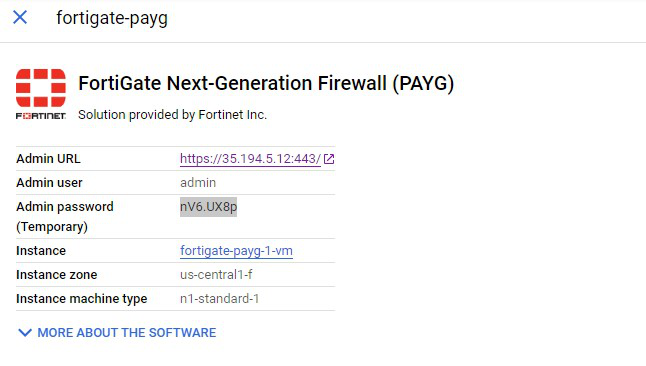

### Create FortiGate using GCP Marketplace

* At the top left of the screen click the Hamburger menu then Select **Compute Engine** > **VM instances**.

    

* Click **CREATE INSTANCE**

  **Any Value not listed below will be left as default.**

1. On the left side of the screen, click **Marketplace**
1. In the pop up, type FortiGate in the search bar and select the **FortiGate Next-Generation Firewall (PAYG)** option.
    
1. In the next pop up, choose **GET Started**
    
1. You will be re-directed to the Agreements screen.  **Check  the box under Terms and agreements** and then click the **AGREE** button
    
1. This will cause a popup indicating thay you have successfully agreed to the terms.  Click **Deploy**
    
1. You will then get another popup describing other APIs that need to be enabled.  On the bottom left of the popup, select **ENABLE**
    
1. Now you will be re-directed to the **New FortiGate Next-Generation Firewall (PAYG) deployment** screen  Any setting, not explicitly listed for change below will left as **default**
1. In the Image Version dropdown under **FortiGate (PayG)** select 7.2.6
1. Under **Networking** > **Network interfaces** click on the down arrow and set the first interface as below and then click **Done**
    
1. Under **Networking** > **Network interfaces** click on **ADD NETWORK INTERFACE** and configure as follows.
    
1. Scroll to the bottom and then click **DEPLOY**.
1. The **Deployment Manager** screen pops up next.  Make note of the Admin URL and Temporary Admin password.
    

{} We used ephemeral for the Public IP of the FortiGate on the untrust NIC.  This means that the IP address could change when the FortiGate is rebooted.  To avoid this, you can go to **VPC network** > **IP addresses** and **RESERVE EXTERNAL STATIC ADDRESS** {} 