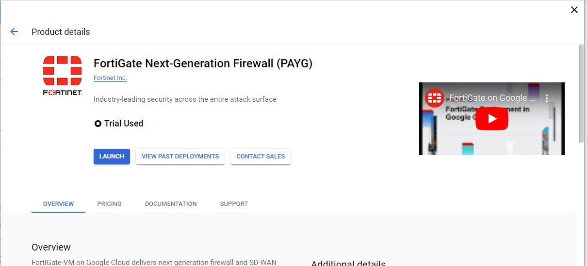
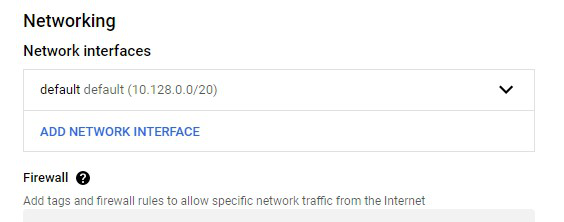
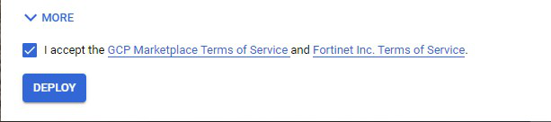

### Create FortiGate using GCP Marketplace

* At the top left of the screen click the Hamburger menu then Select **Compute Engine** > **VM instances**.

    

* Click **CREATE INSTANCE**

  **Any Value not listed below will be left as default.**

1. On the left side of the screen, click **Marketplace**
1. In the pop up, type FortiGate in the search bar and select the **FortiGate Next-Generation Firewall (PAYG)** option.
    
1. In the next pop up, choose **Launch**
    
1. In the Image Version dropdown under **FortiGate (PayG)** select 7.2.6
1. Under **Networking** > **Network interfaces** click on the down arrow next to default.
    
1. Configure the Network as follows and Click **Done**.
    
1. Under **Networking** > **Network interfaces** click on **ADD NETWORK INTERFACE** and configure as follows.
    
1. At the bottom, check box to accept terms and then click **DEPLOY**.
    
1. The **Deployment Manager** screen pops up next.  Make note of the Admin URL and Temporary Admin password.
    

{} We used ephemeral for the Public IP of the FortiGate on the untrust NIC.  This means that the IP address could change when the FortiGate is rebooted.  To avoid this, you can go to **VPC network** > **IP addresses** and **RESERVE EXTERNAL STATIC ADDRESS** {} 