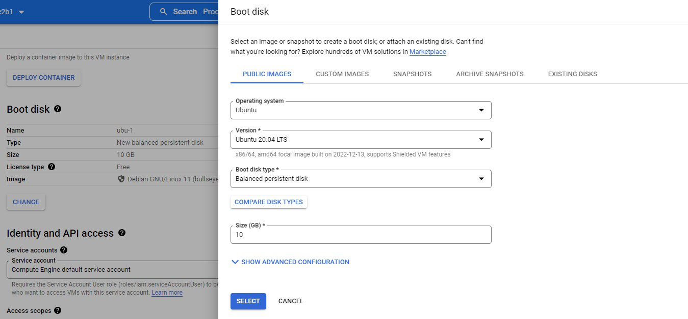
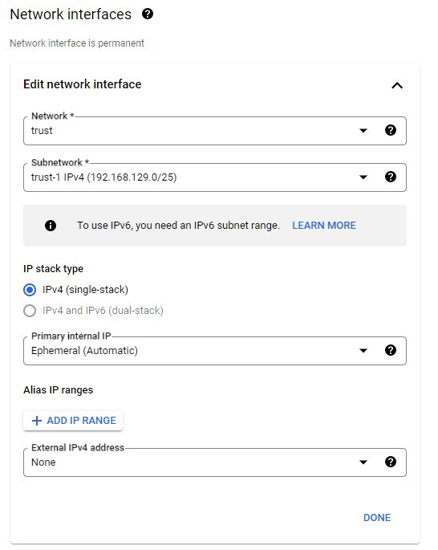

### Create Ubuntu Workload Using GCP Marketplace

* Go to **Compute Engine** > **VM instances** and click **CREATE INSTANCE**

  **Any Value not listed below will be left as default.**

1. Choose an appropriate name for the VM.
1. Under **Boot disk** select **CHANGE**
1. In the pop up select options as pictured below .Use **x86/amd** image

    
1. Click the down arrow to expand **Advanced options**.
1. Click the down arrow to expand **Networking**
1. Under **Network interface**, click the down arrow to expand **default** and change the network settings as follows.  Note that  we are **NOT** assigning an External IP address for this instance.

    
1. Click the down arrow to expand **Management**
1. Under **Automation** paste the below text into the "Startup script" box.

```sh
#!/bin/bash
exec > >(tee /var/log/user-data.log|logger -t user-data -s 2>/dev/console) 2>&1
echo "Wait for Internet access through the FGTs"
while ! curl --connect-timeout 3 "http://www.google.com" &> /dev/null
    do continue
done
apt-get update -y
#install apache2
apt-get install -y apache2
service apache2 restart
/usr/sbin/useradd student1
echo student1:Fortinet1! | chpasswd
usermod -aG sudo student1
sed -i "/^[^#]*PasswordAuthentication[[:space:]]no/c\PasswordAuthentication yes" /etc/ssh/sshd_config
service sshd restart
```

9. Click on **CREATE** at the bottom of the page


