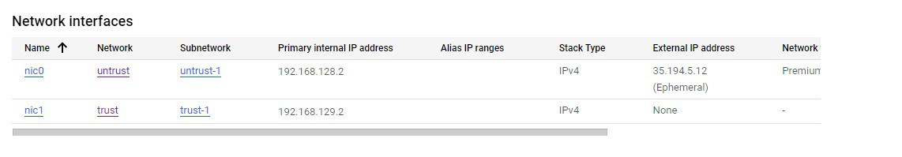
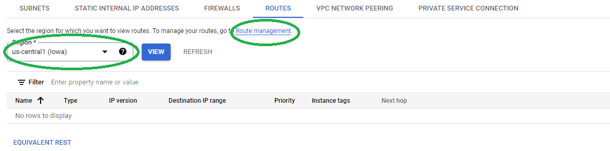
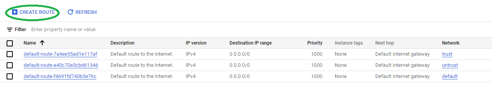
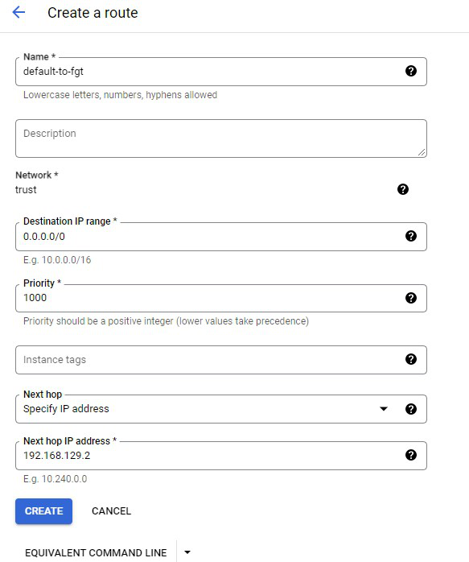

### Configure Routing

We will configure routing such that traffic from the Trust network will route through FortiGate to reach the internet.

* From the Hamburger Menu go to **Compute Engine** > **VM instances** and click on the previously created FortiGate.  Under the Details screen, copy the Primary internal IP address for nic1 **(trust network)**.

    

* From the Hamburger Menu go to **VPC Networks** and click on **trust** in the network list.

* In the center of the screen, click  on **ROUTES**.  In the Region dropdown, choose **us-central1 (iowa)** and then click **Route management**.

    

* This will take you to the VPC network > Routes Screen.  Click on **CREATE ROUTE**

    

* Create the default Route to the Fortigate interface

  **Any Value not listed below will be left as default.**

1. Choose an appropriate name.
1. For "Destination IP range" input "0.0.0.0/0".
1. Under "Next hop" select **Specify IP address**
1. Input the fortigate nic1 IP address as "Next hop IP address"
1. Click **CREATE**

    
