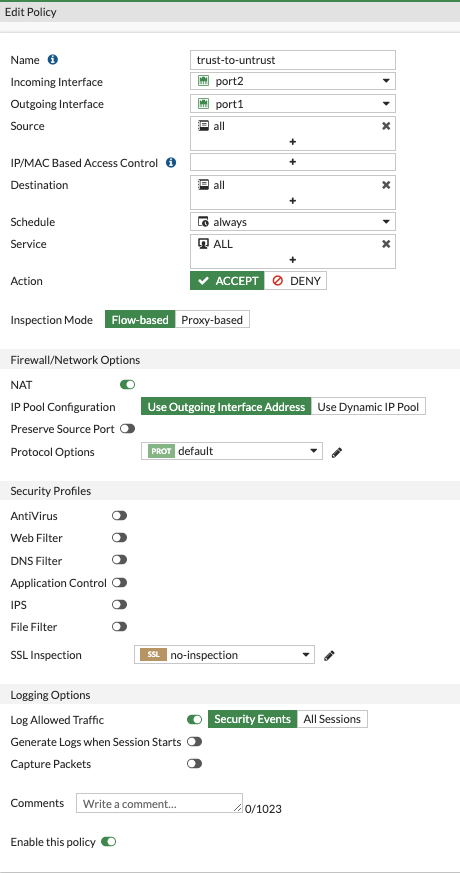

### Create Policy in FortiGate to allow traffic from trust to untrust

We will now create a firewall policy in FortiGate to allow traffic to pass from the trust to untrust networks.

* Log into the FortiGate using the  Admin URL and Temporary Admin password which you noted earlier.  You will be prompted to change the password upon initial login.

* Create a firewall policy allowing all traffic from trust-to-untrust.  If you wait for a few minutes, you should start seeing traffic hitting this policy.  This is the Ubuntu instance updating it's packages and installing apache2.

    
