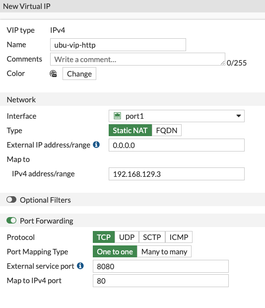
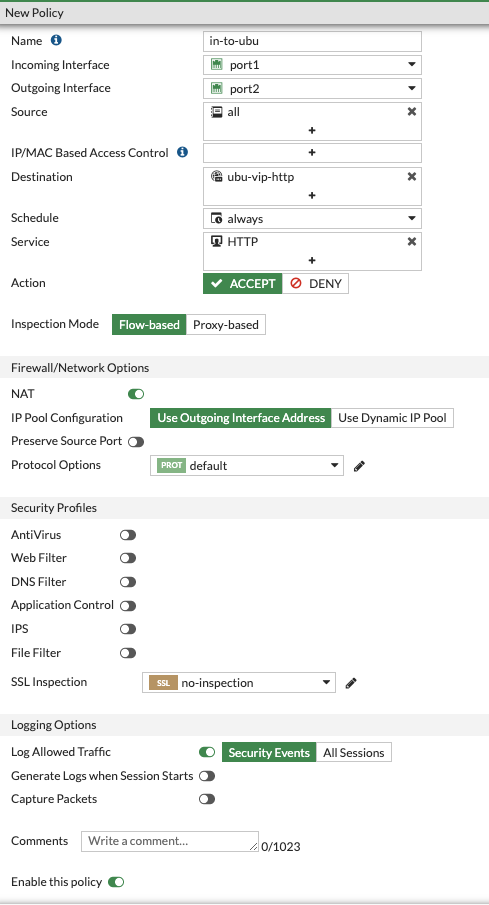
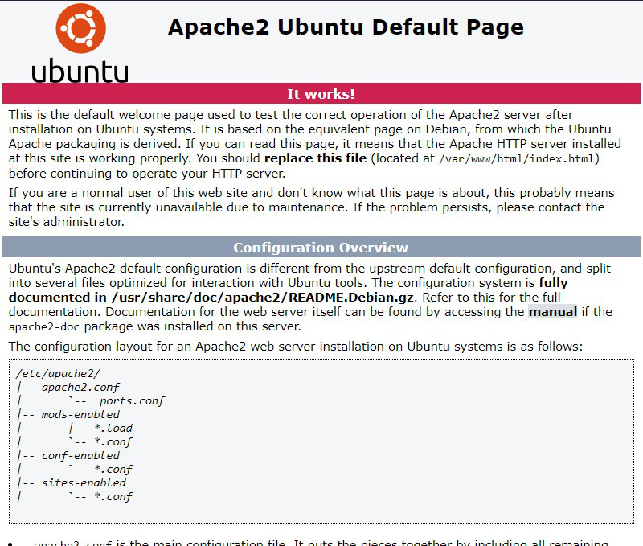

### Create VIP and Policy in FortiGate to allow access to ubuntu server

  **Any Value not listed below will be left as default.**

* Log into the FortiGate and navigate to **Policy & Objects** > **Virtual IP's**

1. Click **Create New** > **Virtual IP**.
1. Choose an appropriate name.
1. Choose **port1** from the dropdown next to **Interface**
1. for **Map to IPv4 address/range** input the internal IP address of the Ubuntu server you created earlier.  **HINT** - go to **Compute Engine** > **VM instances** to find the ip.
1. Click to toggle **Port Forwarding**
1. For **Protocol** select **TCP**
1. For **Port Mapping Type** select **One to one**
1. For **External service port** use **8080**
1. **Map to IPv4 port** should be set to 80
1. Click **OK** to continue

    

* Navigate to **Policy & Objects** > **Fierwall Policy** and create a policy allowing HTTP traffic in to Ubuntu.

    

* In your preferred browser, input **"http://(fortigate-public ip):8080"** (example http://34.72.196.194:8080).  You should get the default Apache2 landing page.

    

{} In this example, we are allowing all IPs inbound and we did not add any security features to our policy.  In a live environment, we would very likely lock this down to specific Source IP addresses as well as add IPS to our policy.  For even better security web servers should be protected by FortiWeb {}