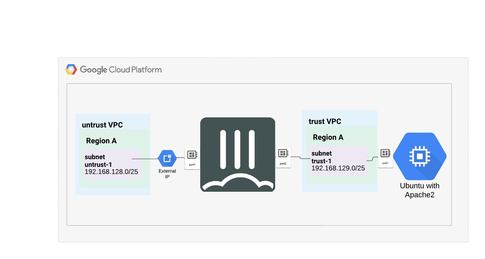

### ***Learn to navigate the GCP Console - estimated duration 60min***

Now that the Compute API is enabled, we can proceed to building a "remote" site, "manually" using the GCP Console.   

  - In this chapter, we will Build the below architecture
  
  

