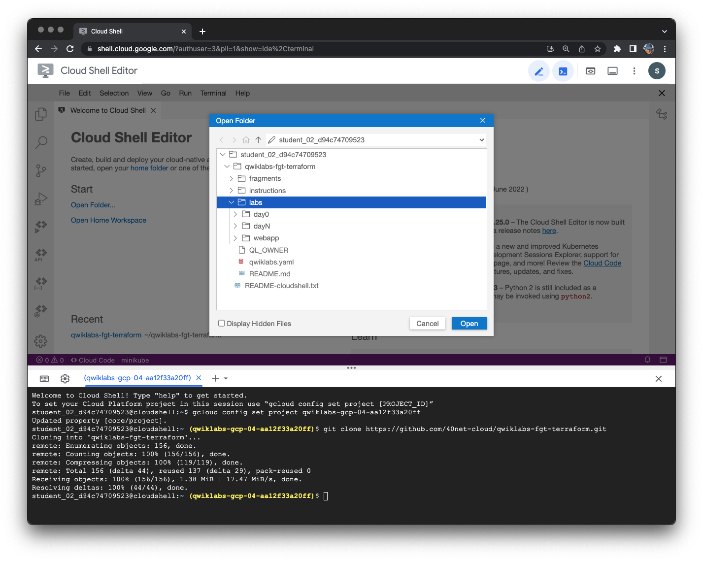

### Clone github repository

This section is fully automated using [Terraform by Hashicorp](https://www.terraform.io/). Terraform is one of the most popular tools for managing cloud infrastructure as code (IaC). While each cloud platform offers its own native tools for IaC, Terraform uses a broad open ecosystem of providers allowing creating and managing resources in any platform equipped with a proper API. In this lab you will use [google provider](https://registry.terraform.io/providers/hashicorp/google/latest/docs) (by Google) to manage resources in Google Cloud and [fortios provider](https://registry.terraform.io/providers/fortinetdev/fortios/latest/docs) (by Fortinet) to manage FortiGate configuration.

All code for this lab is hosted in a public git repository. To use it start by creating a local copy of its contents.

1.	Run the following command in your Cloud Shell to clone the git repository contents:

```sh
    git clone https://github.com/fortidg/se-summit-23.git
```

2.	Change current working directory to **labs/day0** inside the cloned repository:

```sh
cd se-summit-23/qwiklabs-fgt-terraform-lab/labs/day0
```
3. In the **Cloud Shell Editor** part of your Cloud Shell tab choose **File > Open** from the top menu and open the **qwiklabs-fgt-terraform/labs** folder. Cloud Shell Editor will be useful to navigate, review and edit terraform code during this lab.



For the Terraform, each directory containing **.tf** files is a module. A directory in which you run terraform command is the *root module* and can contain *submodules*. In this lab you will deploy two root modules: **day0** and **dayN** with each of them containing submodules. The module structure of **labs** in the cloned **qwiklabs-fgt-terraform** repository looks as follows:

- **labs/day0**
    - **fgcp-ha-ap-lb**
    - **sample-networks**
- **labs/dayN**
    - **app-infra**
    - **secure-inbound**
- **webapp** (does not contain terraform code)
