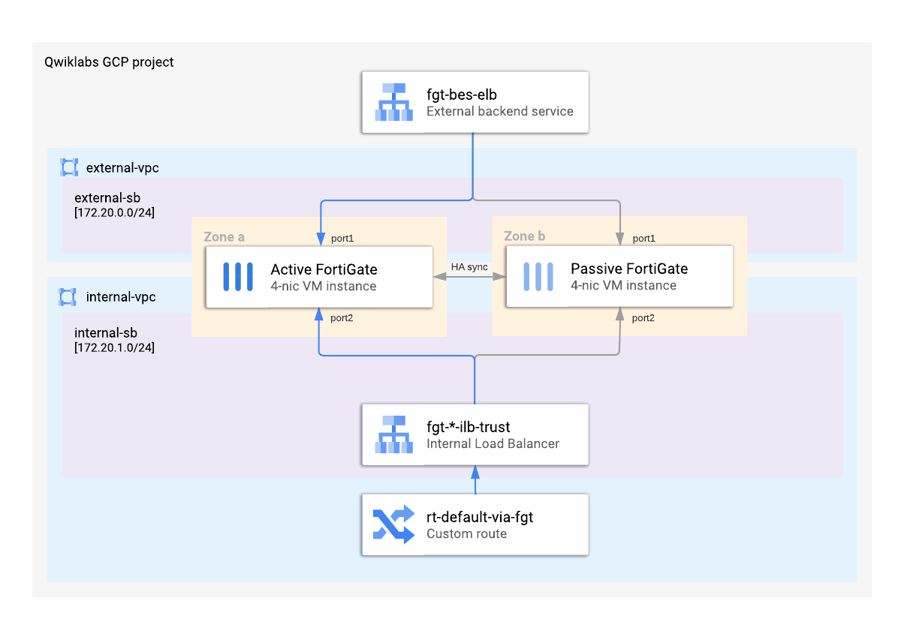
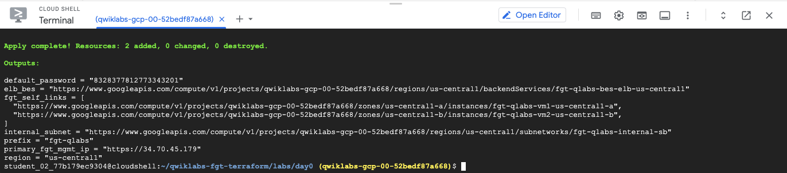
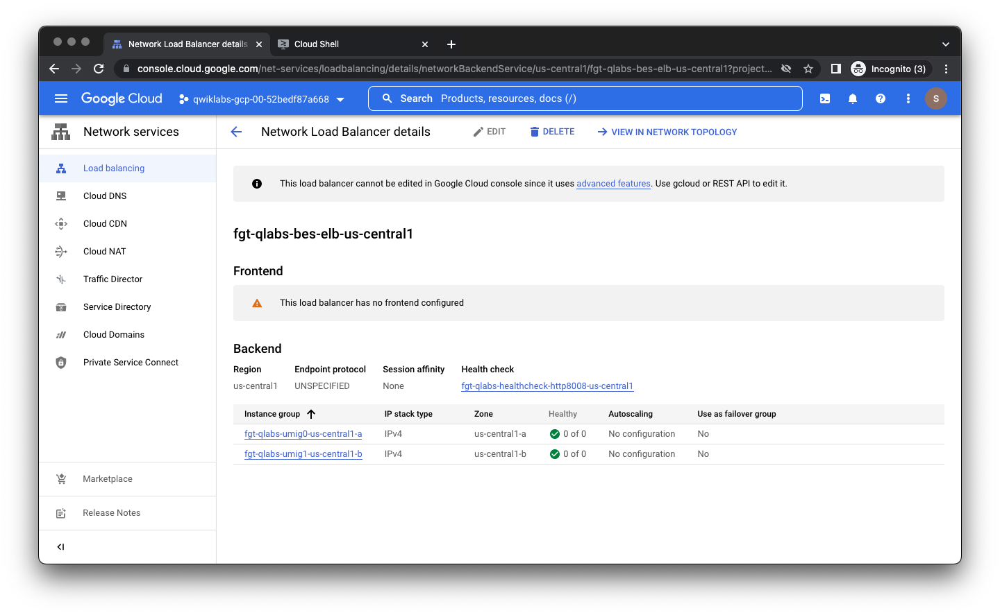

### Use Terraform to deploy FortiGate Cluster

Using **day0** module you will deploy a standard active-passive HA cluster of 2 FortiGate VM instances with a complete Internal Load Balancer used as next hop for the default custom route on the internal (protected) side and an external backend service (load balancer without any frontends) on the external side. **day0** will also create all the necessary VPC networks and subnets, cloud firewall rules, custom route and a cloud NAT used for outbound connections initiated from FortiGates.



FortiGates are bootstrapped with an additional firewall policy allowing outbound traffic (defined in **fgt_config** variable for **fortigates** module in **day0/main.tf**). This policy will enable automated provisioning of web server in later steps.

### Customizing deployment through variables
Before deploying the **day0** module you have an opportunity to customize it. The module expects an input variable indicating the region to use.

As this lab is restricted to use us-central1 region, provide name the region in the **day0/terraform.tfvars** file:
`region = "us-central1"`


### FortiGate cluster deployment
Terraform deployment consists of 3 steps. Execute them now as described below:

1.	In **day0** directory initialize terraform using command

```sh  
    terraform init
```

**This will make terraform parse your **.tf** files for submodules and providers, and download necessary additional files. Re-run `terraform init` every time you add or remove providers and submodules**

2.	Build a terraform plan and save it to **tf.plan** file by issuing command  

```sh
    terraform plan -out tf.plan
```

**Terraform plan file describes every resource to be created and dependencies between them. Planning phase also connects to every provider and checks the state file to verify if any of the resources described in the code already exist or have changed. You should always verify the output of `terraform plan` to understand what resources will be created, changed or destroyed.**

3.	Create the resources according to the plan by issuing command  

```
    terraform apply tf.plan
```

**This command will attempt to create, delete or change the resources according to the plan. If run without providing a plan file `terraform apply` will create a new plan and immediately execute it after confirmation from operator. `terraform apply` should be executed every time after the code or variables change.**

After `terraform apply` command completes you will see several output values which will be necessary in later steps. Terraform outputs can be used to provide additional information to the operator.



### Reviewing the deployment
Once everything is deployed you can connect to the FortiGates to verify they are running and formed the cluster properly. In an FGCP (FortiGate Clustering Protocol) high-availability cluster all configuration changes are managed by the primary instance and automatically copied to the secondary. You can manage the primary instance using your web browser – the web console is available on standard HTTPS port – or via SSH. You will find the public IP address of your newly deployed FortiGate as well as the initial password in the terraform outputs.

1.Select the value of `default_password` terraform output to copy it to clipboard
1. Click the `primary_fgt_mgmt` URL in the outputs to open it in a new browser tab
1. Log in as user `admin` with password from your clipboard
1. Change the initial password to your own
1. Login with your new password
1. Skip through dashboard configuration, possible firmware upgrade offer and the welcome video
1. Ignore the red FortiCare Support warning in the dashboard. It informs you that your support contract was not registered. Support contract is not available for this lab.
1. In the menu on the left select **System > HA**  
    In the table you should see two FortiGate instances with different serial numbers and roles marked as “Primary” and “Secondary”. Initially, the secondary instance might be marked as “Out of sync”, but you can continue without waiting for the cluster to synchronize the configuration.

The **day0** module created a cluster and necessary load balancers, but did not create external load balancer frontend. External IP address and its related load balancer frontend will be created in the following step as part of the application deployment. You can verify that the load balancer **fgt-qlabs-bes-elb-us-central1** has no frontend attached in the GCP web console in **Network services** section available under the menu in top-left corner of the console. Use **Search** in the top bar if you cannot find **Network services** in the menu.

You can notice that the external load balancer has no healthy VMs in the backends list. As the health checks are triggered only after adding a frontend this does not indicate any issue with FortiGates or infrastructure configuration.



 {} At this point you have a fully functional cluster of FortiGates ready to protect traffic sent through it. In the next section you will deploy a web application, create a new public address for it, and redirect the traffic through FortiGate firewalls.{}
