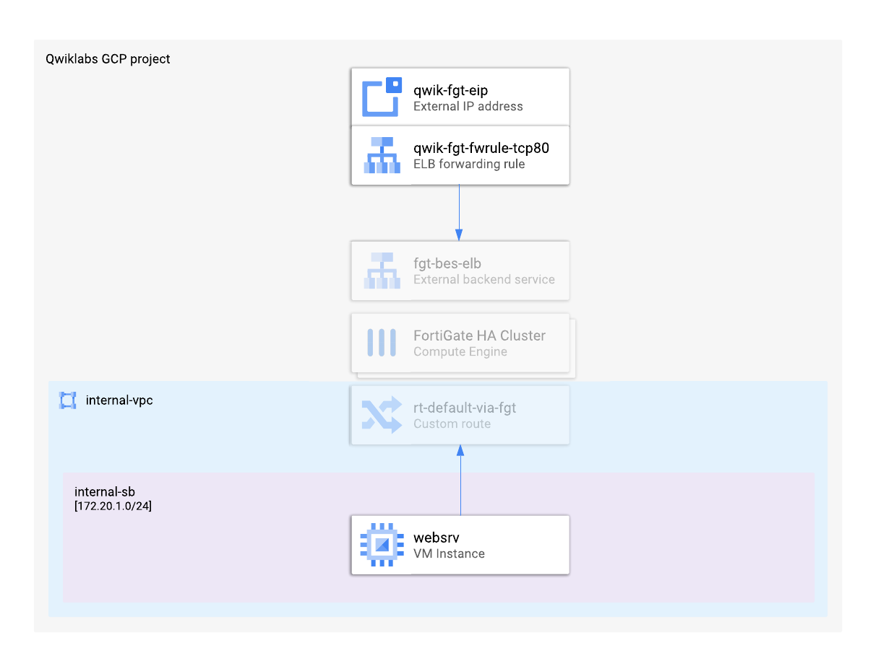
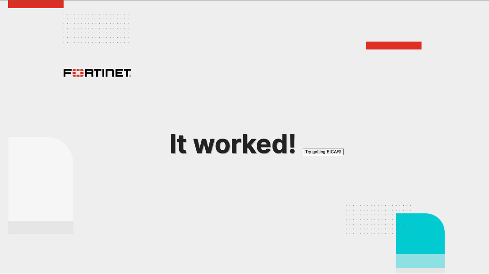
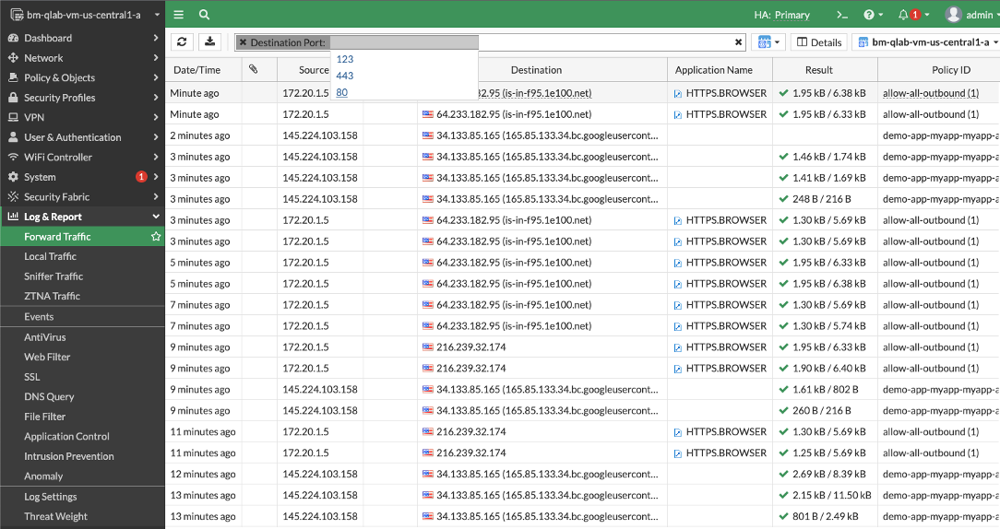
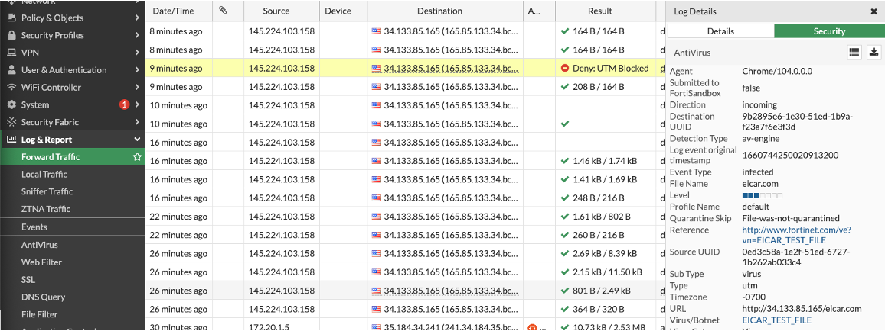

### Use Terraform to deploy Web Application

In this step you will create a new VM and configure it to host a sample web page. While in the production deployments servers are usually deployed to a separate VPC network or even separate projects, this lab creates a single web server VM directly in the same internal subnet to which second network interface of the firewall is connected.

To enable access to the web server VM, **dayN** module utilizes a sample submodule (**secure-inbound**) to create a new external IP address, assign it as a frontend to the external load balancer and configure FortiGates with a new firewall policy and a virtual IP address for destination NAT.



Note how leveraging a reusable submodule can abstract creation of all necessary resources in Google Cloud and in FortiGate.

```sh
module "secure_inbound" {
  source       = "./secure-inbound"

  prefix       = "${var.prefix}"
  protocol     = "TCP"
  port         = 80
  target_ip    = module.app.app_ip
  target_port  = 80

  region       = data.terraform_remote_state.day0.outputs.region
  elb_bes      = data.terraform_remote_state.day0.outputs.elb_bes
}
```

### Deploy web server and FortiGate configuration changes to existing environment
To deploy the sample web application go back to the cloud shell and issue the following commands:

**Do not paste these commands all at the same time.  There is a buffer issue in which the terraform plan command tries to run before the terraform init is complete, leading to an error**

```sh
cd ../dayN
terraform init
terraform plan –out tf.plan
terraform apply tf.plan
```

This time you didn’t have to provide any variables to terraform, because all necessary values (including the region you selected for **day0** module) were automatically pulled by terraform. The possible mechanisms for sharing data between multiple terraform deployments are described in the next section.

### Sharing data between terraform deployments
It is a common scenario where the cloud environment is built in a series of multiple separate deployments. This approach allows to limit the blast radius and makes the code more manageable (often by different teams). In this lab we use a base firewall deployment which in real life would be usually managed by NetSecOps team and a web application deployment managed typically by the application DevOps team. As our goal is to have the application deployment trigger changes to the firewall configuration, both deployments will have to share some common data like the identifiers of firewall-related resources or the FortiGate API access token. There are multiple ways to share this information:

#### Option 1: terraform state file
Terraform saves the current state of the deployment into a state file. State contains all the data terraform needs to link a resource described in the code with its instantiation in the cloud (which doesn’t have to be obvious, as sometimes the name you assign to the resource will not uniquely identify it). It also contains the values of all outputs of your deployment. While it’s a good practice to save the state files in one of multiple available cloud vaults or cloud storage backends available, in this lab we use a simplified approach and save it to a local file on the cloud shell instance disk.

State files can be read, parsed and imported by terraform using the following code used in **dayN/import-day0.tf** file:

```sh
data "terraform_remote_state" "day0" {
  backend = "local"

  config  = {
    path = "../day0/terraform.tfstate"
  }
}
```

you can later reference the retrieved output values as shown in **dayN/main.tf**:

```sh
module "app" {
[...]
  subnet       = data.terraform_remote_state.day0.outputs.internal_subnet
  region       = data.terraform_remote_state.day0.outputs.region
}
```

Note, that while `terraform_remote_state` data block gives access only to the output values, the state file itself contains data you should always treat as confidential and protect as such.

#### Option 2: Secret Manager
Similar to pulling information about the resources from the state file, you can utilize a service specifically designed to store secrets: [Secret Manager](https://cloud.google.com/secret-manager). Using Secret Manager allows building permissions around the CI/CD pipeline, which will make the secret value available to the pipeline, but not to any human operators. As an example we use Secret Manager to store and retrieve the FortiGate API access token:

Created and saved in **day0/fgcp-ha-ap-lb/main.tf**:

```sh
resource "google_secret_manager_secret" "api-secret" {
  secret_id      = "${google_compute_instance.fgt-vm[0].name}-apikey"
}
resource "google_secret_manager_secret_version" "api_key" {
  secret         = google_secret_manager_secret.api-secret.id
  secret_data    = random_string.api_key.id
}
```

and later retrieved in **dayN/providers.tf**:  

```sh
data "google_secret_manager_secret_version" "fgt-apikey" {
  secret         = "${data.google_compute_instance.fgt1.name}-apikey"
}
```

#### Option 3: no sharing
You should always make sure you really need to share any data between modules. Terraform offers a possibility to query the APIs for needed values using its data blocks. You should consider using data instead of sharing variables especially for data that might change over time. For example: if management IP addresses are ephemeral, they may easily drift away from the values known right after initial deployment. The code retrieving the information about primary FortiGate directly from Google Compute API can be found in **dayN/providers.tf**:


```sh
data "google_compute_instance" "fgt1" {
  self_link = data.terraform_remote_state.day0.outputs.fgt_self_links[0]
}
```

And the current public IP of management interface (port4) used later in the same file:

```sh
provider "fortios" {
  hostname = data.google_compute_instance.fgt1.network_interface[3].access_config.nat_ip
}
```

### Verifying the complete setup
Terraform **dayN** module deployed the web application and configured FortiGate to allow secure access to it. The steps below will help you verify and understand the elements of this infrastructure:

1.	Verify that the website is available by clicking the application URL from terraform outputs. A sample webpage should open in a new browser tab. If it’s not available immediately retry after a moment. It takes about a minute for the webserver to start. You should see a simple web page similar to this one:


2.	You can now go back to FortiGate web console and use the menu on the left to navigate to Log & Report > Forward Traffic. You will find connections originating from your computer's public IP with destination set to the IP address of the application (which is the address of the external network load balancer). You can click Add Filter and set Destination Port: 80 to filter out the noise.


3.	In the next step you will verify that FortiGate threat inspection is enabled by attempting to download Eicar - a non-malicious malware test file. Click “Try getting EICAR” button in the middle of the demo web page. Your attempt will be blocked.

4.	In the FortiGate web console refresh the Forward Traffic log to show new entries. One of them will be marked as “Deny: UTM blocked”. Double-click the entry and select “Security” tab in the Log Details frame to show details about the detected threat.


{}In this section you performed tests to verify the newly deployed application is properly deployed and protected against threats by FortiGate next-gen firewall.{}