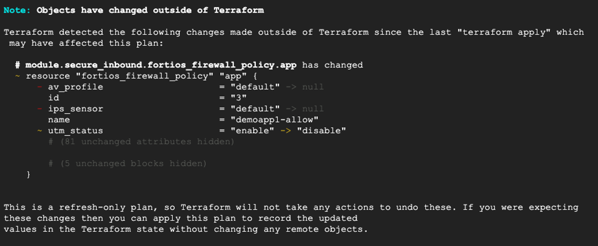
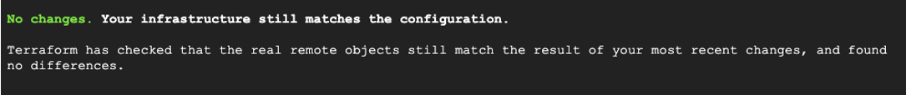

### Use Terraform to fix configuration drift

It can happen that the resources managed by the terraform code are changed manually. After such a change the code, state file and the real configuration are not aligned. It certainly is not a desired situation and is called a “drift”. In this section you will introduce a FortiGate configuration drift and use terraform to fix it.

1.	Connect to FortiGate web console and use menu on the left to navigate to **Policy & Objects > Firewall Policy**. Double-click the **demoapp1-allow** rule in **port1-port2** section, disable all security profiles and save the policy by clicking **OK** button at the bottom.

2.	In the **dayN** directory in Cloud Shell run the following command:  

```sh
terraform plan -refresh-only
```

**The `-refresh-only` parameter instructs terraform to only indicate the changes but not plan them or update the state.**  



3.	To remediate this drift and revert to the configuration described in the terraform file run the command. You can refresh the firewall policy list in FortiGate web console to verify the security profiles were re-enabled.  

```sh
terraform apply
```
    
4.	Mind that not all configuration changes will be detected. To check it, while in FortiGate Firewall Policy list delete the **allow-all-outbound** policy in **port2-port1** section and run again the terraform plan `-refresh-only` command. This time there was no drift detected.  

    

    The reason for this behavior is that only part of FortiGate configuration is managed by terraform. The deleted policy was part of the bootstrap configuration applied during initial firewall deployment (you can find it in **day0/main.tf** file, module “fortigates” block, fgt_config variable).

In many organizations mixing manual and managed configuration is not desired. It provides flexibility but requires extra care when these two types of configuration overlap. Remember that parts of configuration created manually will not be automatically visible to terraform.

### Congratulations!
Congratulations, you have successfully deployed and configured FortiGates in Google Cloud using terraform. The skills and concepts you have learned can help you build secure environments leveraging network security experience of FortiGuard Labs combined with cloud-native workflows, eliminating the requirement to interactively log into the firewall management console.
