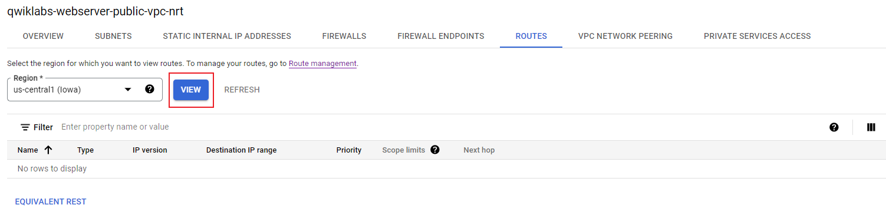
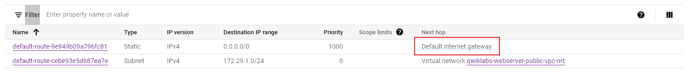
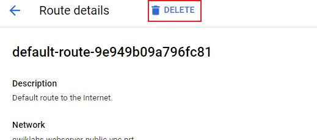
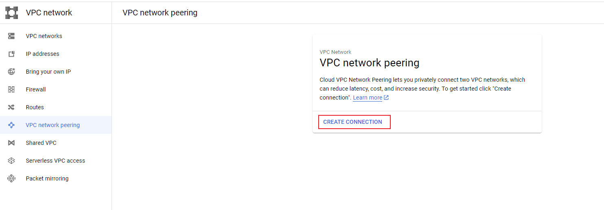
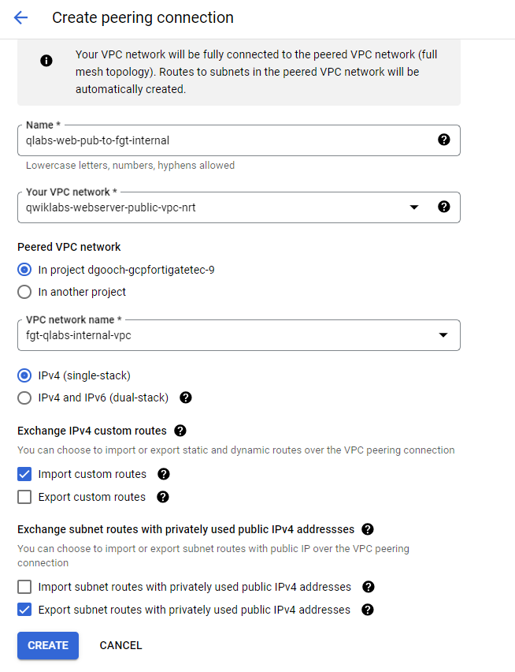

### configure VPC Peering between the "Internal/Private/Trust VPC Network" with the "Web Server VPC Network"

efore creating peerings go back and review the routing. Any new VPC Network is created with a default route via default internet gateway. As you will be creating a peering between the web server VPC and the FortiGate VPC, the desired routing is via FortiGate. To avoid routing conflict you must delete the automatically created default route.

1. Open the VPC network details page for "qwiklabs-webserver-public-vpc" 
2. Click the "ROUTES" tab. In the Region drop down, select "us-central1" and click **VIEW**

3. Select the "Default route to Internet" and click "Delete" button

4. The route list should now contain only the "Default local route to the subnetwork 172.29.1.0/24" 

**Now it's time to create the VPC peerings:**

1. Open VPC network peering page from the Console under the "VPC Network" menu and select **Creat Peering Connection**

2. Click Continue
3. Give a name to the Peering Connection
4. Select the vpc networked named **qwiklabs-webserver-public-vpc-"xxx"**
5. Under **Peered VPC network** select **In project** and select the fortigate internal vpc network name **fgt-qlabs-internal-vpc**
6. Under **Exchange IPv4 custom routes**, select **Import Custom Routes**
7. Ignore the defaults which are selected.
8. Click Create.

Routes are only exchanged when the peering is done from both the sides .i.e. from the "Internal/Private/Trust VPC Network" and "Web Server VPC Network" and vice versa.

You will notice the Status of the VPC Peering as "inactive" until you create the VPC peering from both sides.

10. Repeat for the vpc networked named **fgt-qlabs-internal-vpc**
11. Under **Peered VPC network** select **In project** and select the webserver vpc network name **qwiklabs-webserver-public-vpc-"xxx"**
14. Under **Exchange IPv4 custom routes**, select **Export Custom Routes**
15. Click Create.

{} Within couple of seconds you will notice Status change to "Active" with Green Tick Icon, and routes being exchanged.  You may need to click the refresh button. {}