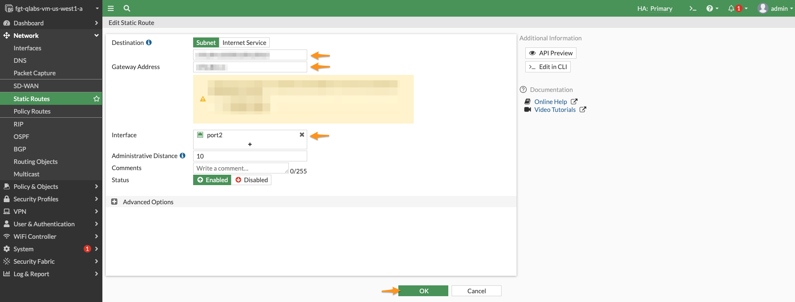
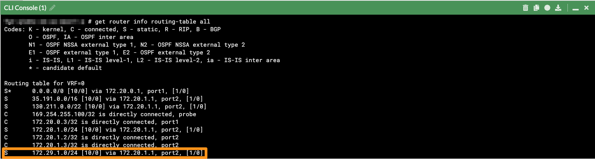
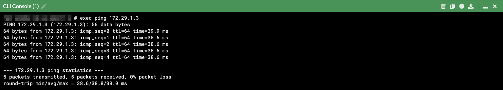

### Configure FortiGate Static route to reach application in peered VPC

Login into the Primary FortiGate of the cluster and create a static route under "Network" menu

1. Destination will be the CIDR range **(172.29.1.0/24)** of the Subnet of the "Web Server VPC Network"
2. Gateway Address will be the "Internal/Private/Trust VPC Network"  Gateway **(172.20.1.1)**
3. Interface will be "port2"
4. Click "OK"



Once Task 5 is completed, one can validate the static route in routing-table of FortiGate from the CLI console of FortiGate, by executing the below command

```
get router info routing-table all
```



#### See the communication
From the FortiGate CLI console, if you ping the Internal IP address of the WebServer, you will notice the response from the Web Server

```
exec ping <INTERNAL_IP_ADDRESS>
```



#### Congratulations!
Congratulations, you have successfully configured the VPC Peering. The skills and concepts you have learned can help you build secure environments leveraging network security experience of FortiGuard Labs combined with cloud-native workflows, eliminating the requirement to interactively log into the firewall management console.
