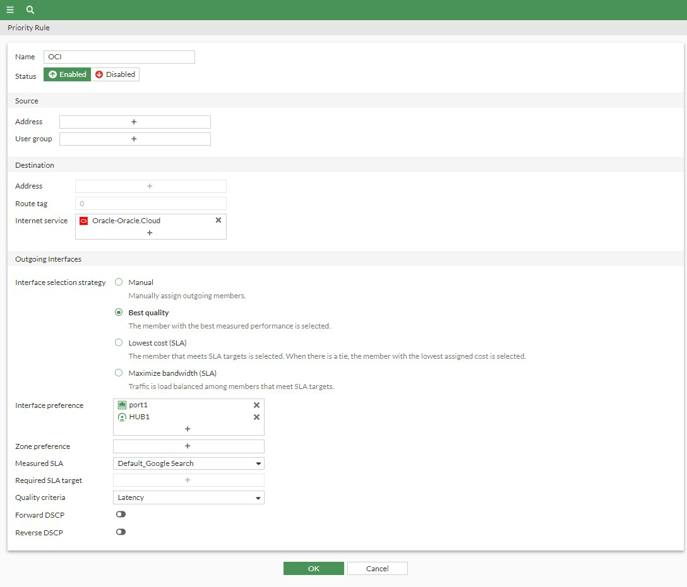

## Create SD-WAN Rules

* Navigate to **Network > SD-WAN > SD-WAN Rules**.  Click **Create new**  Feel free to play around with the Values here.  At a minimum you will need to provide **Name**, **Destination Address or Internet Service**, **Interface selection strategy** and **Interface and/or Zone preference**.  **Note: The minimum required information will change, depending on which selection strategy you choose.  Our example below uses Best Quality, which additionally, requires us to choos a Measured SLA and Quality Criteria**

    

{} useful link - https://docs.fortinet.com/document/fortigate/7.2.5/administration-guide/716691/sd-wan-rules {}

* **Congratulations!** You have completed this course!  Please answer the questions below.