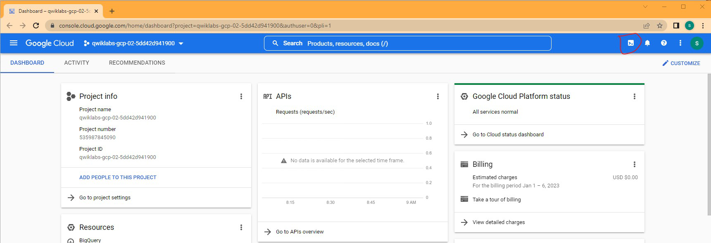
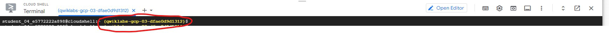
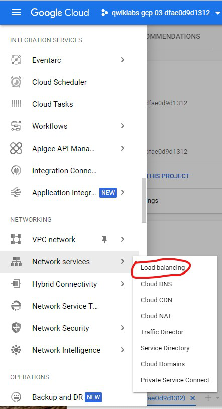
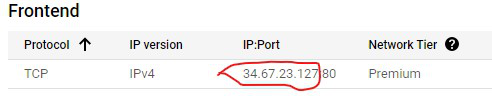
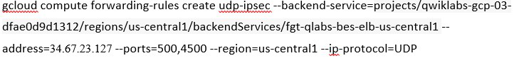

### Add Forwarding Rule to the Load Balancer

{} There is no way to add forwarding rules to the Load Balancer using the GUI Console.  For this step, we will need to open a cloud shell and use the Google SDK.  As you will see in the following steps, we need to create forwarding rules to allow the load balancer to forward UDP ports 500 and 4500 to the FortiGate {}


* We will be using the below Google sdk command to create the forwarding rule.  Copy and paste the below command into your favorite text editor.  The next few steps will help us get the require environment variables (project-id, lb-ip)

```sh
gcloud compute forwarding-rules create udp-ipsec --backend-service=projects/<project-id>/regions/us-central1/backendServices/fgt-qlabs-bes-elb-us-central1 --address=<lb-ip> --ports=500,4500 --region=us-central1 --ip-protocol=UDP
```

* From the GCP console dashboard, select click on the cursor **>_** at the top of the screen.  This will open a **CLOUD SHELL Terminal** at the bottom of the screen.

    

* Get the project-id by copying it from the cloud shell prompt.  We do not need the open and close parentheses.

    

* Get the lb-ip.  Under hamburger menu  select MORE PRODUCTS > Network services > **Load balancing**.  In the center of the screen, Click on LOAD BALANCERS > **fgt-qlabs-bes-elb-us-central1**.

    

* In the center of the screen, under **Frontend** copy the IP address

    

* Once you have the project-id and lb-ip, update the sdk command from earlier and input it into the cloud shell.  Below is an example of what that command should look like.

    

* You should now see the new rule under **Frontend**

