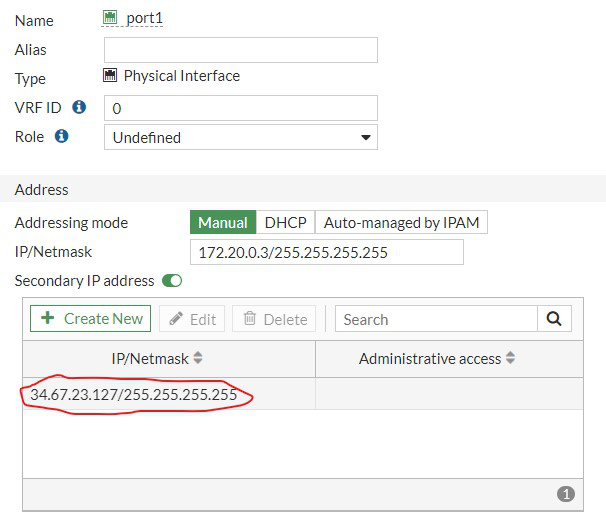

### Configure IPsec VPN Hub on cloud on-ramp FortiGate

The GCP Load Balancer does not perform Destination NAT on inbound traffic to the FortiGate, meaning that the Destination IP address in the UDP port 500 IPsec packets are set to the Load Balancer's external IP address.  We will need to add this IP as secondary to the "WAN" interface (port1) on FortiGate

* Log into the active FortiGate of the cloud on-ramp HA pair.  On the left pane, select **Network** > **Inerfaces**.  Click on port1 and select **Edit**  Under Address, toggle the **Secondary IP address** button and input the lb-ip from earlier.

    

* Open a CLI console in the active FortiGate by clicking on the cursor **>_** icon or using SSH to the public management IP.  Copy the below configurations into your favorite text editor and "set local-gw" to the lb-ip. Once completed, copy and paste thes configurations into the cli console.

```sh
config vpn ipsec phase1-interface
    edit HUB1
        set type dynamic
        set interface port1
        set ike-version 2
        set local-gw <lb-ip>
        set peertype any
        set net-device disable
        set mode-cfg enable
        set proposal aes256-sha256
        set add-route disable
        set dpd on-idle
        set ipv4-start-ip 10.10.1.2
        set ipv4-end-ip 10.10.1.25
        set ipv4-netmask 255.255.255.0
        set psksecret Fortinet1!
        set dpd-retryinterval 60
    next
end


config vpn ipsec phase2-interface
    edit HUB1
        set phase1name HUB1
        set proposal aes256-sha256
    next
end
config system interface
   edit HUB1
        set vdom root
        set ip 10.10.1.254 255.255.255.255
        set allowaccess ping
        set type tunnel
        set remote-ip 10.10.1.1 255.255.255.0
        set snmp-index 18
        set interface port1
    next
end

config firewall policy
    edit 0
        set name ipsec-in
        set srcintf HUB1
        set dstintf port2
        set action accept
        set srcaddr all
        set dstaddr all
        set schedule always
        set service ALL
        set nat enable
    next
    edit 0
        set name ipsec-internet
        set srcintf HUB1
        set dstintf port1
        set action accept
        set srcaddr all
        set dstaddr all
        set schedule always
        set service ALL
        set nat enable
    next
end

```

{} Notice that we are using mode config here.  This will result in IP addresses being dynamically assigned to the IPsec interface on the remote sites.  Make a mental note of the "ip4v-start-ip" and "ipv4-stop-ip".  This range will be used later to configure BGP {}
