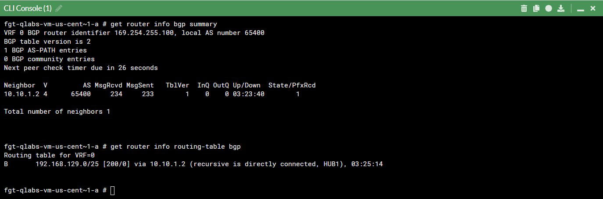
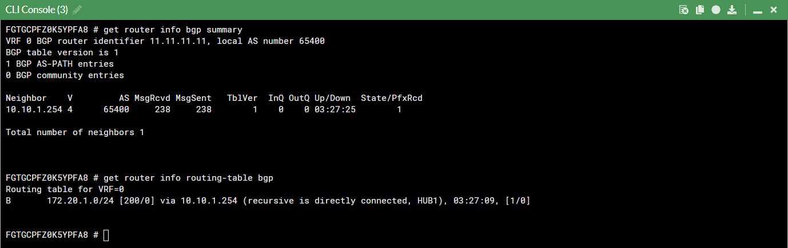

### Configure BGP on remote FortiGate

* Copy the below BGP configurations and paste them into the FortiGate's CLI console.

```sh
config router bgp
    set as 65400
    set ibgp-multipath enable
    set additional-path enable
    set additional-path-select 4
    config neighbor
        edit 10.10.1.254
            set remote-as 65400
            set additional-path receive
        next
    end
    config network
        edit 1
            set prefix 192.168.129.0 255.255.255.128
        next
    end
end

```

* Ensure that BGP peers are established and that routes are being shared on both the hub and remote site.

```sh
get router info bgp summary
get router info routing-table bgp
```

* Below are the expected outputs

    

        

* Ensure continuity from Hub by pinging the remote site Ubuntu server.

```sh
execute ping 192.168.129.3
```

* Ensure continuity from remote site by pinging the Hub Ubuntu server.

```sh
execute ping 172.20.1.5
```