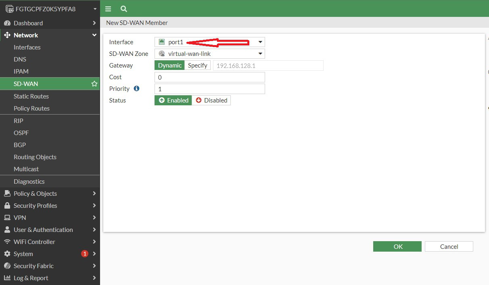
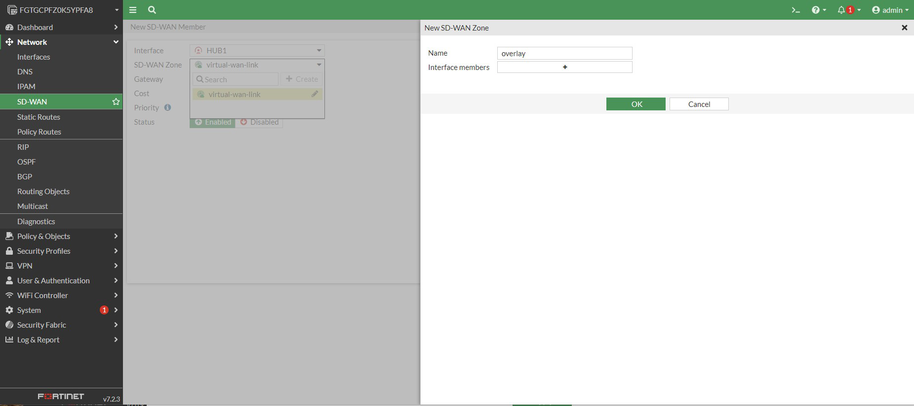

## Add interfaces to SD-WAN on Remote FortiGate

{} In FortiOS, interfaces which already have policies attached to them are precluded from being added to SD-WAN. {}

* On the remote FortiGate, add a static default route pointing out port1.

```sh

config router static
    edit 0
        set gateway 192.168.128.1
        set device "port1"
    next
end

```

* On the remote FortiGate, delete the existing firewall policies by opening a console connection and inputting the below configuration.  

{}This will cause the IPsec tunnel to go down {}

```sh
config firewall policy
delete 1
delete 2
delete 3
delete 4
end
```

* Navigate to **Network > SD-WAN** and click on **Create New > SD-WAN Member** From the **Interface** drop down, choose **port1**.  Leave all other values as default.

    

* Navigate to **Network > SD-WAN** and click on **Create New > SD-WAN Member** From the **Interface** drop down, choose **HUB1**.  In the **SD-WAN Zone** drop down, click **Create** and name the new zone "overlay".  Leave all other values as default and click **OK** 

    

* Open a Console connection and add the below firewall policies.

```sh
config firewall policy
    edit 0
        set name overlay-out
        set srcintf port2
        set dstintf overlay
        set action accept
        set srcaddr all
        set dstaddr all
        set schedule always
        set service SMTP
        set nat enable
    next
    edit 0
        set name vip-in
        set srcintf virtual-wan-link
        set dstintf port2
        set action accept
        set srcaddr all
        set dstaddr ubu-serv
        set schedule always
        set service HTTP
        set nat enable
    next
    edit 0
        set name overlay-in
        set srcintf overlay
        set dstintf port2
        set action accept
        set srcaddr all
        set dstaddr all
        set schedule always
        set service ALL
        set nat enable
    next
    edit 0
        set name port2-out
        set srcintf port2
        set dstintf virtual-wan-link
        set action accept
        set srcaddr all
        set dstaddr all
        set schedule always
        set service ALL
        set nat enable
    next
end
```

 {} After interfaces have been added to SD-WAN, Policies are configured using the SD-WAN zone. This simplifies policy configuration once multiple interfaces are added to the zones {}

 {} useful link - https://docs.fortinet.com/document/fortigate/7.2.5/administration-guide/942095/sd-wan-members-and-zones {}
