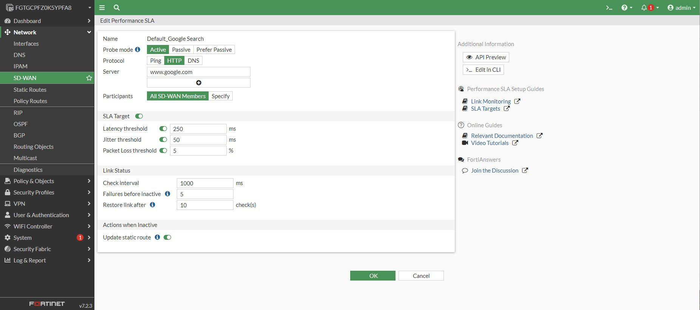
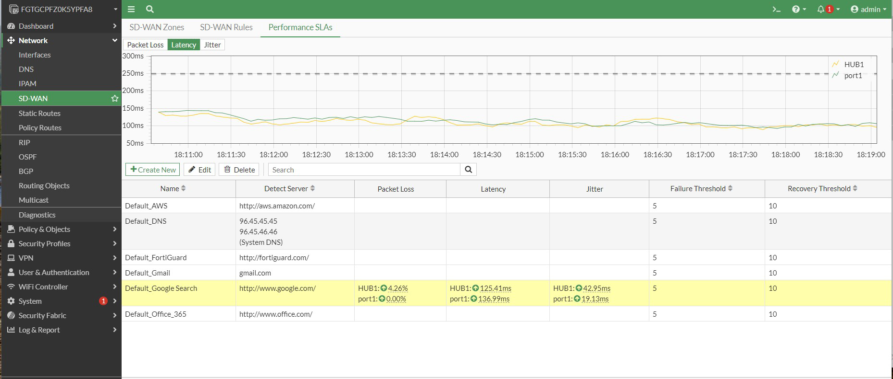
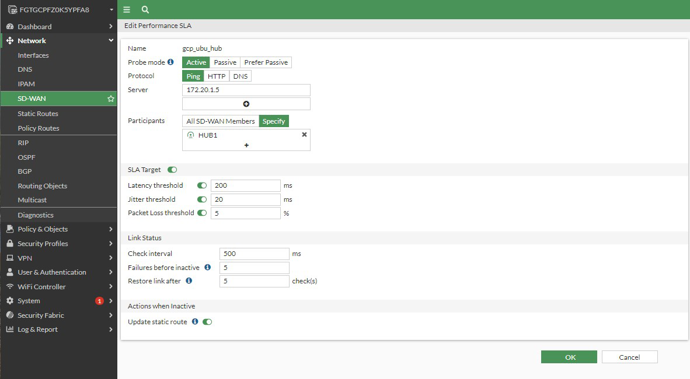

## Create SLA monitoring

* Navigate to **Network > SD-WAN > Performance SLAs** and select the test named **Default_Google_Search"**.  Click **Edit**. Under **Participants** select **All SD-WAN Members**.  Leave all other values as default and click **OK**.  

    

* You may need to refresh the browser in order to see the SLA measurements.  Click on **Default_Google Search**.  You should now see performance data updating in real time for both the **HUB1** and **port1** interfaces.

    

* In the first two steps, we used the default Google performance SLA monitor.  While it's not unheard of to monitor a Public internet site over an IPSec tunnel to the cloud, a more realistic scenario would be to monitor a resource in our own cloud "Data Center"  Below is an example of a custom performance SLA monitoring hour Hub Ubunt Server (created in lab 3).

    

{} useful link - https://docs.fortinet.com/document/fortigate/7.2.5/administration-guide/584396/performance-sla {}