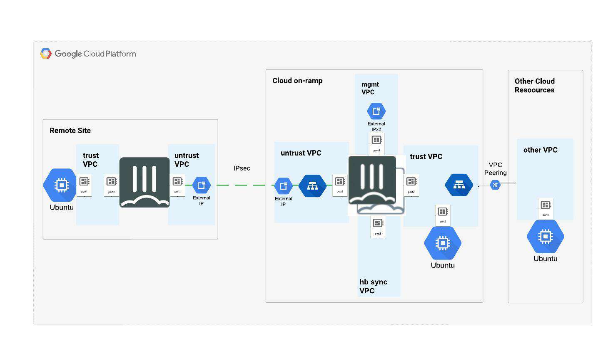

## Overview

This Class will be focused on deployment and configuration of FortiGate in GCP.  There are four Labs in total.  Lab 1 will focus on building a simple environment with a single FortiGate, protecting a sinlge server.  This is designed to introduce the student to the GCP Console and Marketplace.  While not a very common architecture in production deployments, this is quite common for user lab environments.  In Lab 2, the student will use git to clone a Github repository containing Terraform modules designed to deploy a FortiGate Active/Passive high availability pair.  This is a very common deployment used in SD-WAN scenarios as a Cloud On-Ramp, terminating IPsec tunnels.  Lab 3 will use Terraform again to deploy a simple VPC network with a single server.  The student will then configure VPC Peering between this new VPC and the FortiGate VPC.  This emulates a Security Services Hub Architecture in which FortiGate provides both North/South and East/West protection for cloud resources.  Finally, in Lab 4, the student will use the GCP cloud shell to create a forwarding rule in the load balancer in order to allow UDP ports 500 and 4500, needed for IPsec.  The student will then complete the Overlay build between the FortiGate HA pair and the "remote" FortiGate using IPsec, BGP and SLA monitoring.

To complete this lab, you need:

* A gcp account set up by **mis@fortinet.com** based on your Fortinet email address.
* Access to a standard internet browser (Chrome browser recommended).  
* Time to complete the lab---remember, once the lab is started you will have 24 hours to complete the work.  This lab takes an average of 2 to 4 hours to complete and cannot be repeated within 30 days.

Once Completed, the lab build will be similar to the Diagram Below"

